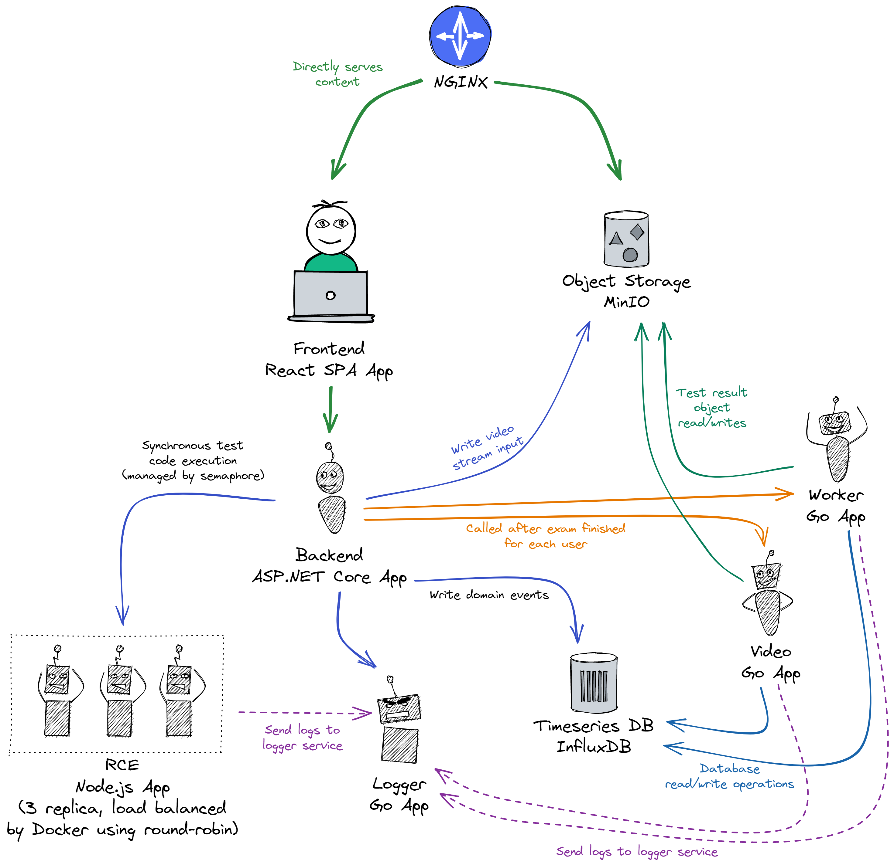

# Spectator

A thesis project to measure a non-invasive stress detection on students' programming activity
through machine learning based on keystroke dynamics, mouse movement and facial expression.
This repository provides the data collection for the thesis.

By the description above, it means we collect each user's movement event and stream it to the backend
that (should) write asynchronously to the database, so that we can serves multiple users concurrently.
Then, for each time-series data of the users, we can accumulate them and create a projection by the
concept of [event sourcing](https://martinfowler.com/eaaDev/EventSourcing.html).
We also must record videos that once again, would be streamed to the backend. Raw videos are
expensive to store and chunks of streamed videos can't be played by normal video player, we would 
need a service to handle the conversion. These two requirements are done after the users finishes their
test. During the test, the users are submitting their code, but instead of checking them after
the test is finished, we could check them during the test by employing a remote code execution engine
that executes user's code. 

The design of this repository is based on a 
[Service Oriented Architecture](https://en.wikipedia.org/wiki/Service-oriented_architecture)
pattern, in which we are not exactly doing microservice, instead we focuses on services that
are written on the appropriate language that solves the problem. The list of services and
the language of choice that are used for each services is explained below. Communication between
services are done with using gRPC (regular RPC, without streaming request/response), whilst
communication between the frontend and the core backend is done using REST (for sending video
stream, admin resources and logging) and SignalR (during the exam).

## Structure

| Codebase  | Description                                                                |
| --------- | -------------------------------------------------------------------------- |
| frontend  | React SPA frontend                                                         |
| backend   | ASP.NET Core core backend API                                              |
| rce       | Node.js service for code execution engine inspired by [Piston][piston-url] |
| logger    | Go service for any logging                                                 |
| worker    | Go service for post-data processing                                        |
| video     | Go service for video processing                                            |
| dummy     | Python sample data generation for InfluxDB                                 |
| assertion | Coding test assertion scripts                                              |
| proto     | Shared protocol buffers contracts                                          |



## Setup

### Development setup

This development setup is for running the whole application on a single machine.
For running each component, see the respective README for each directory.

Prerequisites:
- Docker
- Docker Compose

To run just the InfluxDB:
```sh
docker compose --file docker-compose.influx.yml up -d
```

To run just the MinIO:
```sh
docker compose --file docker-compose.minio.yml up -d
```

To run everything on the development mode:
```sh
docker compose --file docker-compose.dev.yml up -d
```

If you want to stop the containers:

```bash
docker compose --file <which file you run before> stop
```

If you want to drop the containers:
```bash
docker compose --file <which file you run before> down
```

### Production setup

Copy the `docker-compose.yml` file into a `docker-compose.override.yml`, there you can
put your own configuration settings that overrrides the `docker-compose.yml` file.
Put secrets on an `.env` file with corresponding keys that are defined on the `docker-compose.yml`
file. Then, you can run:

```sh
docker compose up -d --build
```

To minimize the storage usage, you can clean up everything without losing your data
or your built image:

```sh
docker container prune -f && \
    docker image prune -f -a && \
    docker builder prune -f
```

## Code of Conduct

Please read [CODE_OF_CONDUCT.md](./CODE_OF_CONDUCT.md) for details on our code of conduct.

## License

TBD.

[piston-url]: https://github.com/engineer-man/piston